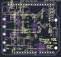
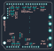

#+TITLE: SimpleFOC DriveShield v1.8 — Pinout and KiCad import
#+DATE: 2026-09-27
#+OPTIONS: toc:2 num:nil
#+HTML_HEAD: 

* Source and status

- Original repository: https://github.com/simplefoc/SimpleFOC-DriveShield
- Fork: https://github.com/Jonwyck/SimpleFOC-DriveShield
- Reviewed upstream commit: =22b4c5506e67aa473017a09c13aa4fd4a453504b=.
- Source files: =EasyEDA/PCB_pcb_drive_2026-08-14.json= and =EasyEDA/SCH_SimpleFOC-Drive_2026-08-14.json=.
- Pinout below was checked against the PCB pad nets and schematic. Solder selections are configurable; no factory jumper population is assumed.
- Initial native KiCad 10.0.1 import is in =../KiCad/=. It is for inspection and migration work, not yet a fabrication release. No circuit modification has been applied.

* Practical 3-PWM connection

The board accepts logic-level switching PWM, not an RC/servo throttle command. Its stock configuration is 3-PWM: one input controls each complementary half-bridge. The signal called =ENABLE= connects to U2 pin 22 and all three INL inputs.

The following is a proposed solder-jumper selection for a bench adapter, not a claim about the delivered board's default bridges. All connector pin numbers are physical pad numbers from the PCB file; =D5=, etc. are Arduino signal names.

| Function | Arduino signal | Physical connector pin | Board connection / selection |
|----------+----------------+------------------------+------------------------------|
| PWM for output M1 | D5 | P1.3 | Bridge INC / INHC to 5; alternative D3 / P1.5 |
| PWM for output M2 | D9 | P2.9 | Bridge INB / INHB to 9; alternative D10 / P2.8 |
| PWM for output M3 | D6 | P1.2 | Bridge INA / INHA to 6; alternatives D11 / P2.7 or D13 / P2.5 |
| Enable | D8 | P2.10 | Bridge EN to 8; alternative D7 / P1.1 |
| Current at M1 | A0 | P3.1 | Bridge CS1 / C2_OUT to A0; alternative A1 / P3.2 |
| Current at M3 | A2 | P3.3 | Bridge CS3 / C1_OUT to A2; alternative A3 / P3.4 |
| Fault return, active LOW | A3 | P3.4 | Close nFLT-to-A3 bridge; reserve A3 for this signal |
| DC-link voltage / 11 | A4 | P3.5 | Bridge VCC/11 to A4; alternative A3 / P3.4 |
| Local logic supply | 3.3 V | P4.4 | Supply 3.3 V referenced to board GND; select 3.3 V-to-VDD bridge |
| Local signal ground | GND | P4.6 or P4.7; also P2.4 | Same electrical ground as DC-bus negative |
| DC-bus positive | VCC / PWR | Large PWR terminal | Planned 12 V link; use this power terminal |
| DC-bus negative | GND | Large GND terminal | Power return |

*Do not close several competing bridges to the same header pin.* A3 can receive fault, M3 current, or bus voltage. The proposal above uses A3 only for fault and A4 for bus voltage; leave the encoder-to-A4 bridge open. Selecting PWM on D11/D13 also conflicts with the SPI connector signals.

The 3.3 V signal supply and its isolation barrier must be on the power-stage side of the interface. Directly connecting an SST MCU ground to this board would defeat the requested controller-to-power-stage isolation. The onboard 8 V regulator supplies the Arduino VIN rail only when its enable bridge is closed; VIN is not the main DC-bus input, and it does not itself supply the required 3.3 V VDD rail.

** Why M1 is not phase A

| Power terminal | Driver phase | Driver PWM input | Inline current signal |
|----------------+--------------+------------------+-----------------------|
| M1 | C | INHC, U2.29 | U5 output C2_OUT; board silk CS1 |
| M2 | B | INHB, U2.27 | No fitted inline current sensor |
| M3 | A | INHA, U2.25 | U1 output C1_OUT; board silk CS3 |

Both fitted current channels have two parallel 4 mΩ shunts (effective 2 mΩ) and INA240A1 gain 20: sensitivity = 0.040 V/A. With VDD = 3.3 V, nominal output is =1.65 V + 0.040 × I=, where positive current flows out of the half-bridge toward the M1 or M3 terminal. This is a transfer equation, not a guarantee of rail-to-rail measurement range. The two channels are nonisolated.

The voltage divider is 47 kΩ over 4.7 kΩ, so =Vout = Vbus / 11=. Despite the net name =0.1_VCC=, its ratio is 1/11, not 1/10. For a 12 V link the nominal feedback is 1.091 V.

** Header numbering

Use the square pad to identify physical pin 1. Do not count pins from the wrong board side. The complete pad/net list is [[file:header-pins.csv][header-pins.csv]].

| Header | Physical pin sequence |
|--------+-----------------------|
| P1, pins 1–8 | D7, D6, D5, D4, D3, D2, unused D1 position, unused D0 position |
| P2, pins 1–10 | SCL, SDA, unused AREF position, GND, D13, D12, D11, D10, D9, D8 |
| P3, pins 1–6 | A0, A1, A2, A3, A4, A5 |
| P4, pins 1–8 | unused, unused IOREF position, unused RESET position, 3.3 V, 5 V, GND, GND, VIN |

The unused positions above have no functional route in this PCB. They should not be assumed to provide reset, UART or reference functions merely because they occupy Arduino header positions.

** Auxiliary connectors

| Connector | Physical pin sequence | Notes |
|-----------+-----------------------+-------|
| CN1, SPI, pins 1–6 | GND, VDD, D11/MOSI, D12/MISO, D13/SCK, D4/CS | External peripheral connector, not an SPI configuration port for DRV8320H |
| CN2, I2C, pins 1–4 | GND, VDD, SDA, SCL | Pull-ups are selectable |
| P_ENC1, pins 1–5 | ENC_A, ENC_B, ENC_I, GND, VDD | Encoder input signals use selectable bridges |

CN1 pads 7/8 and CN2 pads 5/6 are grounded mounting tabs, not extra cable contacts. Encoder assignments: ENC_A → D3/D12/A4; ENC_B → D2/A5; ENC_I → D4/D11/D13. Select only the routes needed and check PWM/SPI/analog conflicts.

* PCB location drawings

These plots come from the imported v1.8 PCB geometry. Pads and original silk are shown. They are useful for locating the jumper groups; they do not prove the solder population on a purchased board.

#+CAPTION: Component side, top view. Match the VCC/GND and M1/M2/M3 power terminals and the square header pads before counting connector pins.
#+ATTR_HTML: :width 1000

#+CAPTION: Solder side, viewed from underneath (mirrored relative to the top view). Locate INA/INB/INC, EN, CS1/CS3, nFLT, VCC/11, and VDD config. Selecting a signal means bridging its centre signal pad to one chosen labelled header pad.
#+ATTR_HTML: :width 1000

* What changes are needed for six independent PWM inputs

The existing headers do not expose six independent gate-command inputs. The AH/AL/BH/BL/CH/CL test points are MOSFET gate-drive outputs; never feed controller PWM into those points.

| Item | Stock circuit | Required for 6-PWM |
|------+---------------+--------------------|
| R10 / MODE, U2.18 | 47 kΩ to GND selects 3-PWM | 0 Ω to GND selects 6-PWM |
| INHA, U2.25 | Selected header PWM for phase A / M3 | Keep independent high-side command |
| INLA, U2.26 | Connected to ENABLE | Separate from ENABLE; route independent low-side command |
| INHB, U2.27 | Selected header PWM for phase B / M2 | Keep independent high-side command |
| INLB, U2.28 | Connected to ENABLE | Separate from ENABLE; route independent low-side command |
| INHC, U2.29 | Selected header PWM for phase C / M1 | Keep independent high-side command |
| INLC, U2.30 | Connected to ENABLE | Separate from ENABLE; route independent low-side command |
| ENABLE, U2.22 | Common board enable | Retain separate enable with a defined LOW shutdown state |

This is a functional conversion description, not a validated trace-cut instruction. Confirm exact routing on the delivered revision before modifying it. External 300 ns deadtime can then be commanded; measure actual high-side and low-side VGS timing after the driver and isolation interface. In stock 3-PWM mode, PWM LOW with ENABLE HIGH turns the low-side MOSFET on. Deassert ENABLE to disable the board.

The hardware driver has a charge pump supporting continuous high-side ON. Its PWM input specification covers 50 kHz, but the assembled board needs thermal and switching-waveform validation at the intended resonant current. Preserve the common DC-bus topology: all three half-bridges on one board share VCC and GND.

* KiCad conversion and validation status

Open [[file:../KiCad/DriveShield_v1_8.kicad_pro][DriveShield_v1_8.kicad_pro]] with KiCad 10.0.1 or later. The schematic and PCB were imported with KiCad's native EasyEDA Standard importers. No third-party converter was needed.

The PCB import report lists 112 footprints, 420 tracks, 442 vias and 29 zones, with four copper layers and no reported import errors or warnings. Standalone jumper/test pads are represented as additional footprints. The schematic can be exported to [[file:../KiCad/DriveShield_v1_8.pdf][PDF]].

The read-only [[file:../KiCad/pad-net-audit.json][pad/net audit]] compares each original component pad and standalone pad with the imported PCB. Its scope is pad numbering and net assignment, not proof of physical copper connectivity or schematic/PCB parity.

Remaining migration work:

1. Reconcile schematic references =U1.1/U5.1= with PCB =U1/U5=, and references without the numbering convention expected by KiCad.
2. Extract/register symbol and footprint libraries, assign schematic footprint identifiers, and link schematic symbols to existing PCB footprints. Imported symbols are embedded, but a complete reusable library setup is not established.
3. Represent the source's physical solder-selection pads explicitly in the schematic. Many source configuration blocks are just unattached net labels; KiCad consequently reports dangling labels.
4. Resolve ERC findings. Initial ERC reports 439 findings: many are unspecified pin types, missing library associations, off-grid endpoints, and source dangling labels. This is not an ERC pass.
5. Resolve PCB DRC and zone validation. Retrying the initial sandbox-aborted check outside the sandbox completed: 1,322 findings (862 errors, 460 warnings), with zero unconnected items. Findings include clearance, hole spacing, padstack, outline and intersecting-zone issues. Some may require restoring original design rules or repairing imported geometry; their causes have not all been resolved. This is not a DRC pass. See =../KiCad/drc.json=.
6. Reconcile schematic/PCB differences before using “Update PCB from Schematic”; do not apply a bulk update to this preliminary import.

The published BOM also retains documentation inconsistencies: 16 V C0603B104K160NT parts are listed at bus bypass positions despite the 30 V advertised maximum, and the MOSFET row's Name and Manufacturer Part fields differ. Verify fitted parts before increasing the bus voltage or releasing a derivative design.

** References

- [[https://docs.kicad.org/10.0/en/eeschema/eeschema.html][KiCad 10 Schematic Editor: EasyEDA import and post-import checks]]
- [[https://dev-docs.kicad.org/en/import-formats/easyeda/index.html][KiCad EasyEDA format documentation]]
- [[https://www.ti.com/lit/ds/symlink/drv8320.pdf][DRV832x datasheet: mode truth tables, charge pump, timing and input levels]]
- [[https://www.ti.com/lit/ds/symlink/ina240.pdf][INA240 datasheet]]
